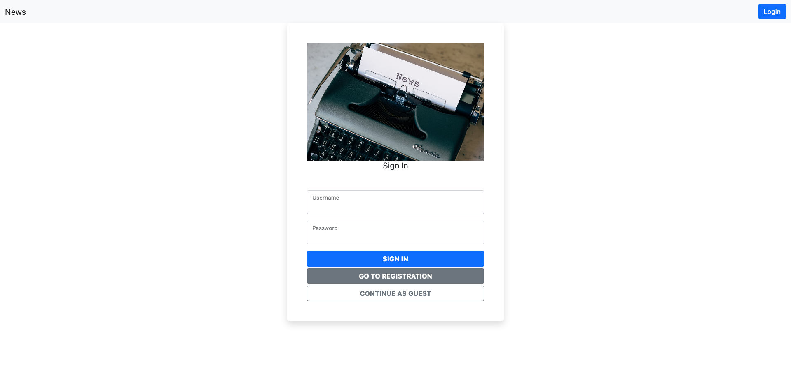
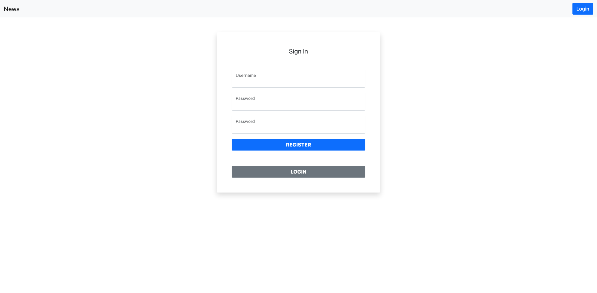
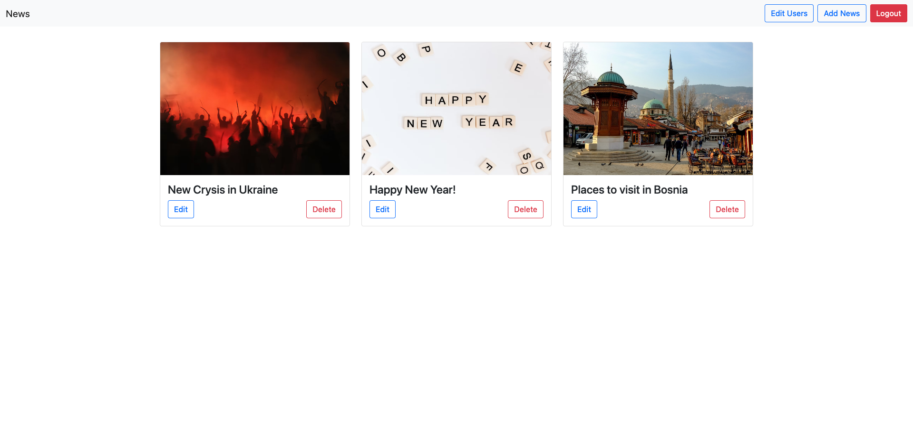
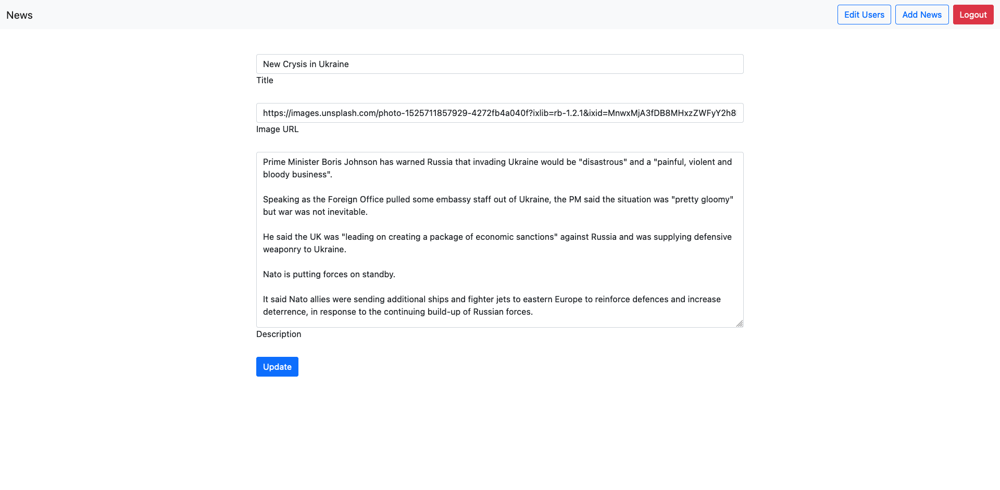
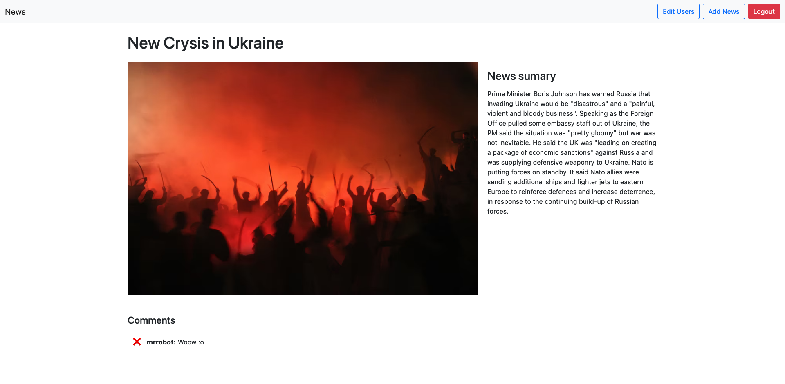
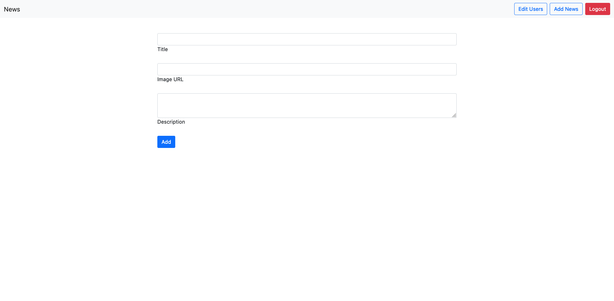
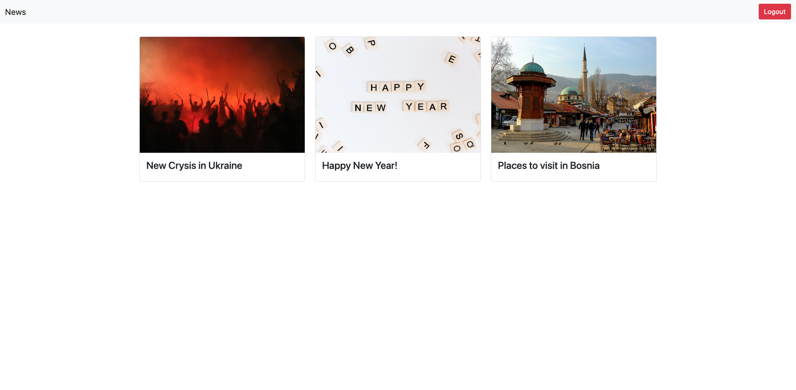
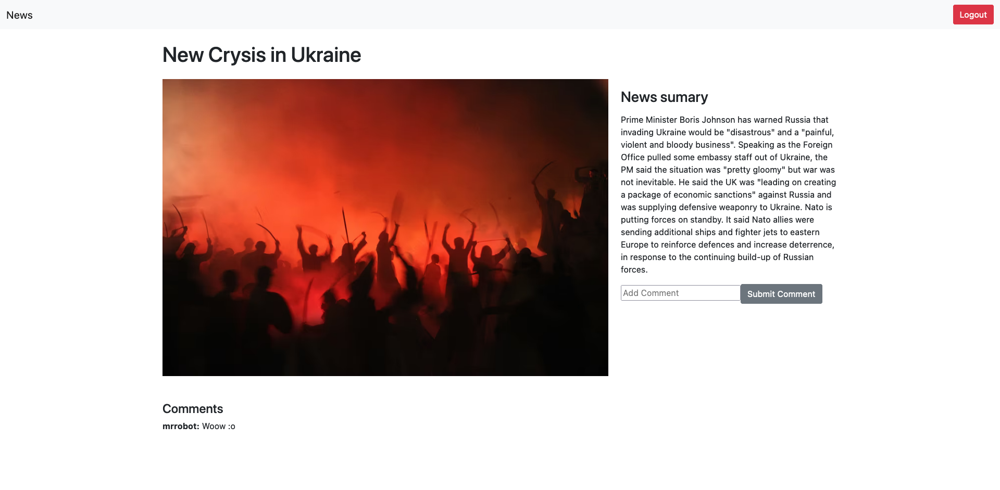

<div id="top"></div>

<!-- PROJECT LOGO -->
<br />
<div align="center">
  


  <h3 align="center">News Portal</h3>

  <p align="center">
    News site where you can find all hot news!
  </p>
</div>


<!-- TABLE OF CONTENTS -->
<details>
  <summary>Table of Contents</summary>
  <ol>
    <li>
      <a href="#about-the-project">About The Project</a>
      <ul>
        <li><a href="#built-with">Built With</a></li>
      </ul>
    </li>
    <li>
      <a href="#getting-started">Getting Started</a>
      <ul>
        <li><a href="#prerequisites">Prerequisites</a></li>
        <li><a href="#installation">Installation</a></li>
      </ul>
    </li>
    <li><a href="#usage">Usage</a></li>
  </ol>
</details>


<!-- ABOUT THE PROJECT -->
## About The Project

News site where you can register and comment on any news post! After first registration you will need to wait for admin to verify you and then you will be able to login. You have an option to login as a guest but you won't be able to comment!
 <br />
 
 ### Root directory layout

    .
    ├── client   
    ├── server
    ├── dbinfo_122.sql
    └── README.md
    
  
<br />
  
### Client directory layout

    .
    ├── public
    ├── src
    ├── .gitignore
    ├── package.lock.json
    ├── package.json
    └── .gitignore

<br />
  
  
### Server directory layout

    .
    ├── controller
    ├── routes
    ├── .gitignore
    ├── index.js
    ├── package.lock.json
    └── package.json
    

<p align="right">(<a href="#top">back to top</a>)</p>


### Built With

* [React.js](https://reactjs.org/)
* [NodeJS](https://nodejs.org/en/)
* [ExpressJS](https://expressjs.com/)
* [Axios](https://www.npmjs.com/package/axios)
* [Nodemon](https://www.npmjs.com/package/nodemon)
* [MySQL](https://www.mysql.com/)

<p align="right">(<a href="#top">back to top</a>)</p>


<!-- GETTING STARTED -->
## Getting Started

### Prerequisites

Install NPM
* npm
  ```sh
  npm install npm@latest -g
  ```
Start your MySQL server and run the script included in the project.

### Preparation

1. Clone the repo
   ```sh
   git clone https://github.com/MagicPojska/my-music-app.git
   ```
2. Install NPM packages in client folder
   ```sh
   npm install
   ```
3. Open server folder in Visual Studio 2022 and start the server
   ```sh
   npm start
   ```
4. Start client
   ```sh
   npm start
   ```


<p align="right">(<a href="#top">back to top</a>)</p>


<!-- USAGE EXAMPLES -->
## Usage

Login screen:


Registration screen:


Home screen as admin:


Edit users screen:


Edit news posts:


Details page as admin:


Add news:


Home as user:


Details page as user and comments:



<p align="right">(<a href="#top">back to top</a>)</p>


<!-- CONTACT -->
## Contact

Safet Pojskić - pojskicsafet@gmail.com

<p align="right">(<a href="#top">back to top</a>)</p>
